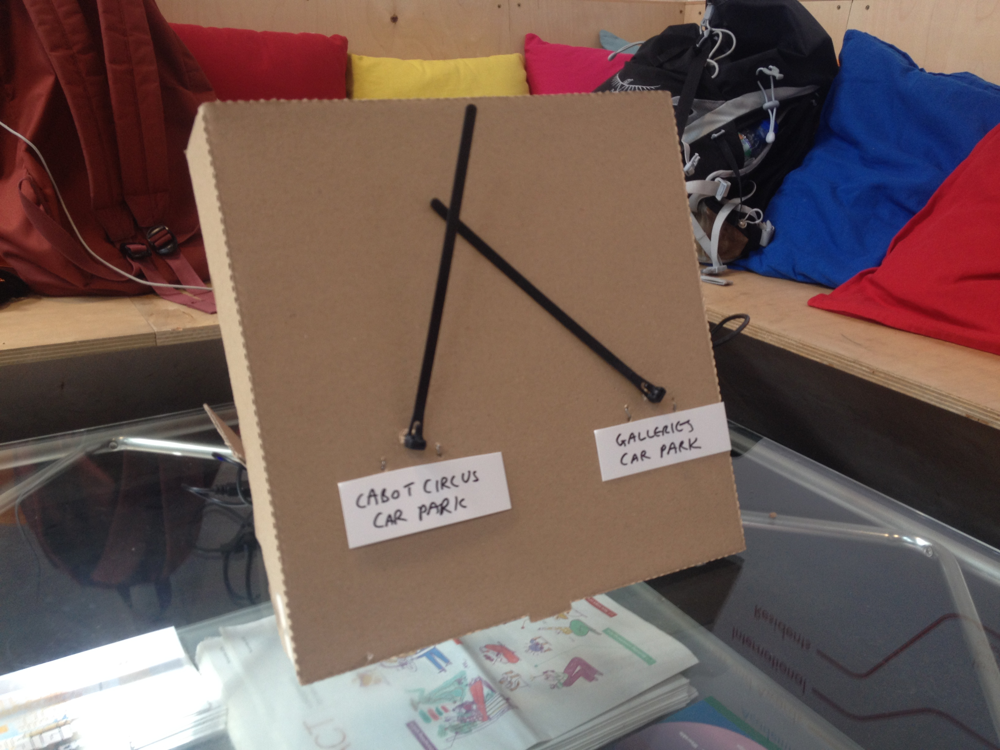
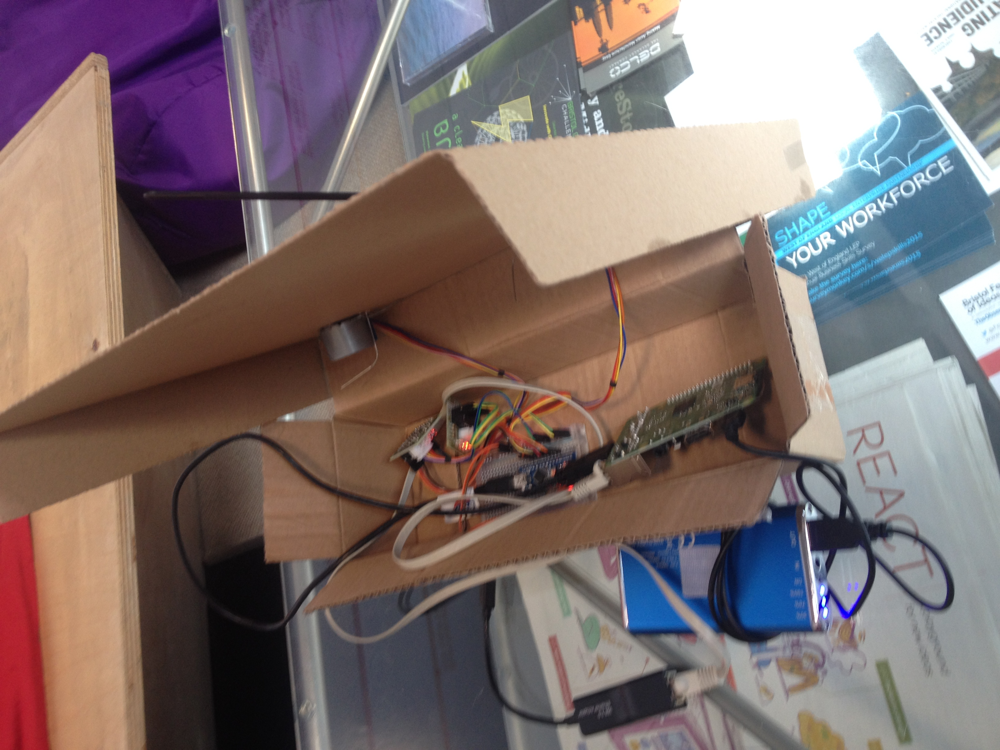

# Car Park Dial

A quick(-ish) hack to display some real-time open carpark data 
on physical dials using stepper motors.

You'll need the [AccelStepper 
library](http://www.airspayce.com/mikem/arduino/AccelStepper/).

The Bristol Open Data API is here 
[https://portal-bristol.api.urbanthings.io/#/home](https://portal-bristol.api.urbanthings.io/#/home) and there's a real-time website for the carparks [here](https://opendata.bristol.gov.uk/Mobility/Car-Park-Occupancy/a427-ptgs)

It's designed to be an appliance, based on a Raspberry Pi, with an 
Arduino and two stepper motors.

# Installation

## Set up your pi including the wifi

I used [these 
instructions](https://planb.nicecupoftea.org/2016/03/20/wifi-connect-quick-wifi-access-point-to-tell-a-raspberry-pi-about-a-wifi-network/) 
on a Pi 3.

## Install the pieces

     git clone https://github.com/libbymiller/car_park_dial
     cd car_park_dial
     npm install sleep serialport

then run it with a key from [https://portal-bristol.api.urbanthings.io/](https://portal-bristol.api.urbanthings.io/)

     KEY="XXX" node send_data_to_serial.js 

# Wiring

When you wire up the Arduino to the motor drivers, the middle two wires 
need to be swapped, or it won't go backwards.

# Running it on startup

I used Supervisor (```sudo apt-get supervisor```) with the config ```car_park_dial_supervisor.conf``` 
copied into ```/etc/supervisor/conf.d/```.

# Thanks

I used physical pieces and code from 
[Shonkbot](https://github.com/jarkman/shonkbot) and the wifi "appliance mode" from [Radiodan](http://radiodan.net). Richard Pope's [bicycle barometer](http://www.cyclelove.net/2012/12/bicycle-barometer-a-nanode-project-by-richard-pope/) was a big inspiration.

# Pictures





